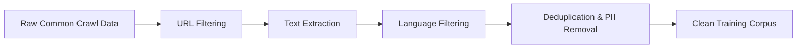
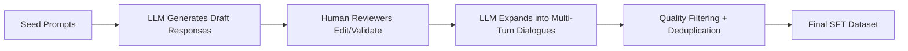
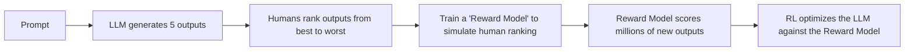
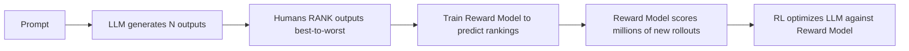

# Deep Dive To LLM

## Pretraining Stage
### 🎯 Goal of Pretraining

| Aspect | Description |
|--------|-------------|
| **Primary Objective** | Collect and process vast amounts of text from the internet to teach the model statistical patterns of language |
| **Output** | A massive tokenized corpus ready for neural network training |
| **Key Principle** | Quality + Quantity + Diversity of documents = Better model knowledge |

---

### 📦 Data Sources & Collection

#### Primary Sources

| Source | Description | Scale/Stats |
|--------|-------------|-------------|
| **Common Crawl** | Non-profit organization crawling the web since 2007; primary raw data source for most LLMs | ~2.7 billion web pages indexed (as of 2024) |
| **FineWeb Dataset** (Hugging Face) | Production-grade curated dataset used as representative example | ~44 TB of high-quality text; ~15 trillion tokens |

> 💡 **Key Insight**: Even though the internet is massive, aggressive filtering results in a manageable ~44 TB dataset.

---

### 🔍 Data Filtering & Cleaning Pipeline

##### Processing Flow



##### Filtering Stages Explained

| Stage | Purpose | Implementation Details |
|-------|---------|----------------------|
| **URL Filtering** | Remove undesirable domains | Blocklists for malware, spam, adult content, hate speech, low-quality marketing pages |
| **Text Extraction** | Extract meaningful text only | Parse raw HTML; strip markup, CSS, navigation, boilerplate; keep only content text |
| **Language Filtering** | Control language composition | Classifier detects primary language per page; e.g., retain pages with >65% English content |
| **Deduplication** | Prevent overfitting | Remove duplicate content across the corpus |
| **PII Removal** | Privacy protection | Detect and filter addresses, phone numbers, IDs, personal information |

##### Design Choices & Implications

| Choice | Impact on Final Model |
|--------|----------------------|
| English-focused filtering (>65%) | Model excels at English; weaker at other languages |
| Aggressive quality filtering | Higher signal-to-noise ratio; smaller but cleaner dataset |
| PII removal | Reduced privacy risks; potential loss of some contextual data |

---

### 🔤 Tokenization: Converting Text → Model Input

##### Why Tokenization is Necessary

| Input Format | Vocabulary Size | Sequence Length | Verdict |
|--------------|----------------|-----------------|---------|
| Raw text (characters) | ~100+ (letters, symbols) | Very long | ❌ Inefficient |
| Raw bytes | 256 | Extremely long | ❌ Too slow for training |
| **BPE Tokens** | ~100,000 | Optimized length | ✅ Production standard |

##### Byte Pair Encoding (BPE) Algorithm

```python
# Conceptual BPE workflow
1. Start with byte-level tokens (IDs 0-255)
2. Find most frequent consecutive pair (e.g., "t" + "h" → "th")
3. Merge pair into new token ID (e.g., ID 256)
4. Add new token to vocabulary
5. Repeat iteratively until target vocab size reached (~100K)
```

##### Tokenization Facts

| Property | Detail |
|----------|--------|
| **Vocabulary Size** | ~100,000 tokens (GPT-4: 100,277 tokens) |
| **Token ≠ Character** | Each token represents a chunk of text (e.g., `"hello"`, `" world"`, `"ing"`) |
| **Case-Sensitive** | `"Hello"` ≠ `"hello"` → different token IDs |
| **Space Handling** | Leading spaces often included in token (e.g., `" world"` vs `"world"`) |
| **Tool for Exploration** | [`tiktoken`](https://github.com/openai/tiktoken) library |

###### Example Tokenizations (GPT-4 / cl100k_base)

| Input Text | Tokens | Token IDs |
|------------|--------|-----------|
| `"hello world"` | `["hello", " world"]` | `[15339, 11917]` |
| `"helloworld"` | `["h", "elloworld"]` | `[44, 271]` |
| `"Hello world"` | `["Hello", " world"]` | `[2060, 11917]` |
| `"hello  world"` (2 spaces) | `["hello", "  world"]` | `[15339, 220]` |

---

### 📊 Final Output of Preprocessing

##### FineWeb Dataset Stats

| Metric | Value |
|--------|-------|
| Raw disk space | ~44 TB (compressed text) |
| Tokenized sequence | ~15 trillion tokens |
| Format | 1D sequence of token IDs (integers) |
| Ready for | Next-token prediction training |

##### What the Model Sees

```
Before tokenization:
"Bar view in single article about tornadoes in 2012..."

After tokenization:
[19203, 4521, 882, 3962, 11917, ...]  ← 15 trillion integers
```

> 🧠 **Mental Model**: Think of pretraining data preparation as refining crude oil into high-grade fuel — raw internet → filtered → tokenized → ready to power the model.

---

### 🔑 Key Takeaways

| Takeaway | Explanation |
|----------|-------------|
| ✅ **Heavily curated, not raw** | Pretraining data undergoes extensive filtering; it's not just "scraped internet" |
| ✅ **Tokenization is critical compression** | BPE balances vocabulary size vs. sequence length for computational efficiency |
| ✅ **Language filtering is strategic** | Directly impacts model's multilingual capabilities; a deliberate design choice |
| ✅ **~15T tokens = statistical fuel** | Scale of data enables learning of language patterns through next-token prediction |
| ✅ **PII removal & deduplication matter** | Essential for privacy, safety, and preventing model overfitting |

---

## Neural Network I/O

### Input to the Neural Network

**Token Sequences as Input:**
- The neural network receives **sequences of tokens** as input (not raw text)
- These are windows of tokens taken from the training data
- Window length can vary from 0 up to a maximum context length (e.g., 8,000 tokens in modern models, 1,024 in GPT-2)
- Example: A window of 4 tokens like `[bar, view, in, single]` with token IDs

**Context Window:**
- The input tokens are called the **"context"**
- This is a finite, precious resource - you can't have infinite tokens
- Longer contexts are computationally expensive
- The context window represents the model's "working memory"

### Output from the Neural Network

**Probability Distribution:**
- The output is a **probability distribution** over all possible next tokens
- The number of outputs equals the **vocabulary size** (e.g., 100,277 for GPT-4)
- Each output number represents the probability of that specific token coming next in the sequence

**Example:**
- Input: 4 tokens (`bar view in single`)
- Output: 100,277 probabilities (one for each possible token)
- The model might predict:
  - Token "article" (ID 3962): 3% probability
  - Token "direction" (ID 11799): 2% probability  
  - Token "case" (ID 15339): 4% probability

### Training Process

**Next Token Prediction:**
- The model is trained to predict the **next token in the sequence**
- During training, we know the correct answer (the actual next token from the data)
- The network's parameters are adjusted to:
  - **Increase** the probability of the correct next token
  - **Decrease** the probabilities of incorrect tokens

**Iterative Updates:**
- Each update slightly adjusts the neural network
- After an update, the same input sequence would produce slightly different probabilities
- This process repeats across all tokens in the entire dataset (15 trillion tokens for FineWeb)
- Done in parallel with large batches of tokens

### Key Concepts

**Input-Output Relationship:**
- **Input**: Variable-length sequence of token IDs (0 to max context length)
- **Processing**: Mathematical transformation through the neural network
- **Output**: Fixed-size vector of probabilities (size = vocabulary size)

**Stateless Processing:**
- Each forward pass is independent
- The network has no memory between passes
- All context must be provided in the input token sequence

This I/O mechanism is fundamental to how language models work - they're essentially sophisticated **token autocomplete systems** that predict what comes next based on statistical patterns learned during training.

## Inference

### What is Inference?

**Inference** is the process of **generating new data** from a trained model. This is what happens when you interact with ChatGPT - the model has already been trained, and now it's generating responses based on your input.

### How Inference Works

**Step-by-Step Process:**

1. **Start with a prefix** - You provide initial tokens (your prompt/question)
2. **Feed into the network** - The model processes these tokens
3. **Get probability distribution** - The network outputs probabilities for all possible next tokens (e.g., 100,277 probabilities for GPT-4)
4. **Sample from distribution** - Flip a "biased coin" to select the next token
   - Tokens with higher probability are more likely to be sampled
   - This introduces **stochasticity** (randomness)
5. **Append and repeat** - Add the sampled token to the sequence and repeat the process

### Key Characteristics

**Stochastic System:**
- Every generation is different, even with the same prompt
- The model samples from probability distributions at each step
- Different "coin flips" lead to different paths through token space

**Example from transcript:**
```
Starting with: "bar view in single"
Possible continuations:
- "article" (token 3962) - sampled in one run
- Could be different tokens in other runs
```

**"Remixes" of Training Data:**
- The model doesn't just copy training data verbatim
- It creates **statistical remixes** - sequences that have similar properties to training data but are often novel
- Sometimes it reproduces exact chunks from training (especially if seen many times)
- Other times it generates completely new combinations

### Base Model Behavior

When interacting with a **base model** (not fine-tuned as an assistant):

- It's just a **token autocomplete** system
- It continues whatever token sequence you give it
- It doesn't inherently know to be helpful or answer questions
- Example: If you ask "what is 2+2", it might continue with philosophical discussion rather than "4"

### Inference vs Training

| Aspect | Training | Inference |
|--------|----------|-----------|
| **Purpose** | Learn patterns from data | Generate new sequences |
| **Parameters** | Being updated | Fixed/frozen |
| **Data** | Uses entire dataset | Uses only context window |
| **Cost** | Very expensive (months on thousands of GPUs) | Relatively cheap (seconds/minutes) |
| **When** | Done once (or occasionally) | Done every time you use the model |

### Important Implications

**1. No Memory Between Sessions:**
- Each inference is independent
- The model doesn't remember previous conversations
- All context must be provided in the current token sequence

**2. Context Window is Critical:**
- This is the model's "working memory"
- Everything the model "knows" during inference must be in the context window
- Knowledge in parameters = vague recollection
- Knowledge in context = directly accessible

**3. Temperature and Sampling:**
- The "biased coin flip" can be adjusted
- Higher temperature = more random/creative
- Lower temperature = more deterministic/focused

### Practical Example

From the transcript, when generating from the model:
```
Prefix: [91] (token)
→ Sample → [860] (relatively likely token)
→ Sample → [287]
→ Sample → [next token]
→ And so on...
```

Each step involves:
- Computing probabilities for all 100,277+ tokens
- Sampling one based on those probabilities
- Adding it to the context
- Repeating

### Key Takeaway

**Inference is token-by-token generation** where the model acts as a sophisticated autocomplete system, sampling from learned probability distributions to create coherent sequences that statistically resemble its training data, but are often novel combinations.

## GPT-2 Training and Inference

### GPT-2 Overview

**Model Specifications:**
- **Published**: 2019 by OpenAI
- **Parameters**: 1.5 billion (1.6B mentioned in one instance)
- **Context Length**: 1,024 tokens maximum
- **Training Data**: ~40GB of internet text
- **Architecture**: Transformer neural network

**Historical Significance:**
- First time a recognizably modern LLM stack came together
- All pieces of GPT-2 are recognizable in today's models, just bigger
- Represented a major milestone in language model development

### Training Cost Evolution

**Then vs Now:**
| Time Period | Cost | Hardware |
|-------------|------|----------|
| 2019 (original) | ~$40,000 | Limited GPU availability |
| Today (reproduction) | ~$600 | Modern H100 GPUs |
| Today (optimized) | ~$100 | Further optimizations possible |

**Reasons for Cost Reduction:**
1. **Better datasets**: More refined filtering, extraction, and preparation
2. **Faster hardware**: Modern GPUs (H100) significantly more powerful
3. **Better software**: Optimized implementations for running models efficiently

### Training Process Demonstration

**What Training Looks Like:**
```
Step 20/32000 | Loss: 10.663 | Time: 7.2s | Tokens: 1M per update
```

**Key Training Metrics:**
- **Loss**: The critical number to watch - decreases as model improves
- **Updates**: Each line represents one parameter update
- **Batch Size**: 1 million tokens processed per update
- **Total Steps**: 32,000 optimization steps
- **Total Tokens**: ~33 billion tokens processed (32,000 × 1M)

**Training Progress:**
- **Early stage (Step 20)**: Completely random output, gibberish
- **1% complete**: Starting to show local coherence but still poor
- **Full training**: Generates fairly coherent English

### Inference Demonstration

**Early Training Output (1% complete):**
```
"since she is mine it's a part of the information should discuss 
my father great companions Gordon showed me sitting over at..."
```
- Not very coherent
- Has some local structure but largely nonsensical

**Fully Trained Output:**
- Generates coherent English
- Tokens flow correctly
- Much better quality

### Computational Infrastructure

**Hardware Setup:**
- **8× H100 node**: Computer with 8 NVIDIA H100 GPUs
- **Cloud rental**: Services like Lambda Labs provide on-demand access
- **Cost**: ~$3 per GPU per hour for H100
- **Scaling**: 
  - 1 GPU → 8 GPUs (single node) → Multiple nodes (data center)

**Why GPUs:**
- Neural network training is computationally expensive
- GPUs provide massive parallelism
- Can handle many independent matrix multiplications simultaneously
- Perfect fit for the parallel nature of neural network computations

**The GPU Gold Rush:**
- Big tech companies desperately need GPUs for LLM training
- This demand has driven NVIDIA's stock to ~$3.4 trillion
- Example: Elon Musk acquiring 100,000 GPUs for a single data center
- All these GPUs working together to predict next tokens

### Practical Training Details

**What Researchers See:**
```
Every line = One update to the model
Loss decreasing = Model getting better
Inference every 20 steps = Check progress
```

**Training Workflow:**
1. Process 1 million tokens per update
2. Each update takes ~7 seconds
3. Every 20 steps, run inference to check quality
4. Watch loss decrease over time
5. Wait for training to complete (1-2 days for GPT-2 scale)

**Key Insight:**
- Training is mostly waiting and monitoring
- Researchers "twiddle thumbs, drink coffee" while ensuring loss decreases
- The process is computationally intensive but conceptually simple

### Model Release Components

**What's Needed to Release a Model:**
1. **Source Code** (~hundreds of lines)
   - Describes the neural network architecture
   - Implements the forward pass
   - Relatively standard and understandable

2. **Trained Parameters** (1.5 billion numbers)
   - The actual "value" of the model
   - Precise setting of all parameters
   - What makes the model work well

**GPT-2 Repository:**
- Available on GitHub
- OpenAI released both code and parameters
- Community could reproduce and build upon the work

### Key Takeaways

**Training is Expensive But Getting Cheaper:**
- 2019: $40,000 barrier to entry
- Today: ~$100-600 for same model
- Democratization of LLM training

**Scale is Everything:**
- Modern models are just GPT-2 but bigger
- Same principles, more parameters, more data, longer context
- GPT-4 has ~trillion parameters vs GPT-2's 1.5B

**Infrastructure Matters:**
- GPU availability is the bottleneck
- Cloud providers enable access to expensive hardware
- Training requires serious computational resources

**Training is Predictable:**
- Loss should steadily decrease
- Output quality improves over time
- Process is well-understood and reproducible

## Llama 3.1 Base Model Inference

### Introduction to Base Models

**What is a Base Model:**
- A base model is the output of the pre-training stage - an "internet document simulator" at the token level
- It's trained on internet documents but is NOT yet an assistant
- It's a token autocomplete system that continues whatever token sequence you give it
- Base models are rarely released because they're just step one of several stages needed to create a useful assistant

### Llama 3.1 Specifications

**Model Details:**
- **Size**: 405 billion parameters (largest base model released by Meta)
- **Training Data**: 15 trillion tokens
- **Released by**: Meta (Facebook)
- **Availability**: Open weights - anyone can download and use
- **Context Length**: Significantly larger than GPT-2's 1,024 tokens (modern models have much longer contexts)

### Interacting with Base Models

**Where to Access:**
- **Hyperbolic**: Serves the Llama 3.1 405B base model
- **Important**: Must specifically select "base" model, not "instruct" model
- The instruct model is already fine-tuned to be an assistant; the base model is the raw pre-trained version

**Key Behavioral Characteristics:**

1. **Not an Assistant**
   - When you ask "what is 2+2", it won't respond "4, and can I help you with anything else?"
   - Instead, it continues the token sequence statistically based on what it saw in training
   - It might go off into philosophical territory or continue the question rather than answer it

2. **Stochastic System**
   - Every generation is different even with the same prompt
   - The model samples from probability distributions at each step
   - Different "coin flips" lead to different paths through token space
   - You'll get varied responses each time

3. **Regurgitation vs. Remixing**
   - Sometimes reproduces exact chunks from training (especially if seen many times)
   - Other times generates completely new combinations
   - Creates "statistical remixes" of training data

### Demonstrations with Llama 3.1 Base

**Example 1: Direct Question**
```
Prompt: "what is 2+2"
Result: Goes off into philosophical territory, doesn't directly answer
```
The model treats this as a token sequence to continue, not a question to answer.

**Example 2: Eliciting Knowledge**
```
Prompt: "Here's my top 10 list of the top landmarks to see in Paris"
Result: Generates a list of Paris landmarks
```
By priming the model with the start of a list, it continues in that pattern, drawing on knowledge stored in its parameters.

**Important Caveat**: This knowledge is:
- A "vague recollection" of internet documents
- Not precise or exact
- Statistical and probabilistic
- More reliable for frequently occurring information
- Less reliable for rare facts

**Example 3: Exact Regurgitation**
```
Prompt: First sentence from Wikipedia article about zebras
Result: Model recites the Wikipedia entry almost verbatim
```
- The model has memorized this content because:
  - Wikipedia is high-quality data sampled preferentially during training
  - The model likely saw this page ~10 times (multiple epochs)
  - Like reading something 100 times, you can recite it from memory
- Eventually deviates from exact text when memory runs out

**Example 4: Hallucination about Future Events**
```
Prompt: "The Republican Party picked Trump, president from 2017..."
(Priming with tokens from after the training cutoff of end of 2023)

Result 1: Running mate was Mike Pence, against Hillary Clinton
Result 2: Running mate was Ron DeSantis, against Joe Biden
```
- The model has NO knowledge of 2024 election
- It's taking educated guesses based on statistical patterns
- This is **hallucination** - making up plausible-sounding but false information
- Different samples give different "parallel universe" scenarios

### In-Context Learning

**Few-Shot Prompting:**
Even though it's a base model (not an assistant), you can build practical applications through clever prompt design.

**Example: English to Korean Translation**
```
Prompt Structure:
apple → 사과
book → 책
teacher → 선생님
[10 examples total]
teacher → [completion]

Result: "스승" (correct translation)
```

**How it Works:**
- The model detects the algorithmic pattern in the context
- It's "learning in place" from the examples provided
- This is called **in-context learning**
- The model takes on the role of a translator based on the pattern

**Key Insight**: The context window acts as "working memory" - information here is directly accessible, unlike the vague recollection in parameters.

### Creating an Assistant from a Base Model

**Prompt Engineering Trick:**
You can instantiate a whole language model assistant just by prompting, even with only a base model.

**Method:**
Structure the prompt to look like a conversation between a helpful AI assistant and a human, then the model continues that conversation.

**Example Prompt Structure:**
```
<|im_start|>system
You are a helpful AI assistant...
<|im_end|>
<|im_start|>user
What is 2+2?
<|im_end|>
<|im_start|>assistant
[Model generates response here]
```

**Why This Works:**
- The model has seen tons of conversations in its training data
- When you provide the conversation format, it statistically continues in that pattern
- It takes on the "assistant" role because that's what comes next in the sequence

**Limitations:**
- It will just continue generating (doesn't know when to stop)
- Might hallucinate the next human question after answering
- Not as reliable as a properly fine-tuned instruct model

### Knowledge: Parameters vs. Context Window

**Critical Distinction:**

| Knowledge in Parameters | Knowledge in Context Window |
|------------------------|----------------------------|
| Vague recollection | Working memory |
| Statistical patterns from training | Directly accessible information |
| Compressed, lossy | Exact, complete |
| Like what you remember from reading a month ago | Like what you're reading right now |

**Practical Implication:**
```
BAD Prompt:
"Can you summarize chapter one of Pride and Prejudice?"
→ Relies on vague recollection
→ May miss details or get things wrong

GOOD Prompt:
"Can you summarize chapter one of Pride and Prejudice? 
Here's the text: [paste full chapter]"
→ Information is in context window
→ Direct access → higher quality summary
```

This is equivalent to you re-reading the chapter before summarizing it vs. trying to remember it from months ago.

### Base Model vs. Instruct Model

**Base Model (what we've been discussing):**
- Raw output of pre-training
- Token autocomplete
- Continues any sequence
- Not directly useful for most applications
- Requires clever prompting

**Instruct Model (what comes after post-training):**
- Base model + supervised fine-tuning on conversations
- Trained to be helpful, truthful, harmless
- Responds to questions appropriately
- What you interact with in ChatGPT, Claude, etc.
- Much more useful out of the box

### Key Takeaways from Base Model Interaction

1. **Base models are token simulators**, not assistants
2. **Stochastic behavior** - different outputs each time
3. **Knowledge is statistical** - vague recollection, not exact facts
4. **Can regurgitate** frequently-seen content (like Wikipedia)
5. **Will hallucinate** about unknown topics
6. **In-context learning** works - provide examples in the prompt
7. **Context window is working memory** - put important info there
8. **Can simulate an assistant** through prompt engineering, but it's not ideal

### Transition to Post-Training

The base model is interesting but not directly useful. We want an **assistant** that:
- Answers questions helpfully
- Is truthful and harmless
- Can have multi-turn conversations
- Refuses inappropriate requests

This requires the **post-training stage**, specifically **supervised fine-tuning (SFT)**, which we'll cover next.

---

**Mental Model**: Think of the base model as a very knowledgeable but untrained intern who has read the entire internet but doesn't know how to be helpful. They'll just continue whatever you start saying. Post-training teaches them how to be a useful assistant.


## Post-Training

---

## 🎯 Overview: What is Post-Training?

Post-training is the stage where a **base model** (internet document simulator) is transformed into a **helpful assistant** that can answer questions, follow instructions, and engage in multi-turn conversations.

> **Key Distinction**: Pre-training = knowledge acquisition from internet | Post-training = programming assistant behavior through conversation data

---

## 🗣️ 1. Conversation Structure & Tokenization

### Why Conversations Need Special Encoding
- LLMs only understand **1D sequences of tokens**
- Conversations are structured objects (human ↔ assistant turns)
- Must be encoded into token sequences using a **protocol**

### Example: Tokenizing a Simple Conversation
```
User: What is 2+2?
Assistant: 2+2 is 4.
```

**Encoded as tokens** (GPT-4 format example):
```
<|im_start|>user<|im_sep|>What is 2+2?<|im_end|>
<|im_start|>assistant<|im_sep|>2+2 is 4.<|im_end|>
```

| Special Token | Purpose |
|--------------|---------|
| `<|im_start|>` | Marks beginning of a turn ("imaginary monologue start") |
| `<|im_sep|>` | Separates speaker label from content |
| `<|im_end|>` | Marks end of a turn |
| `user` / `assistant` | Speaker role tokens (new IDs added to vocab) |

> 💡 These special tokens are **newly introduced** during post-training — they were never seen in pre-training data.

### Inference Flow with Conversations
1. User types query → system formats it with conversation protocol tokens
2. System appends `<|im_start|>assistant<|im_sep|>` and stops
3. Model samples tokens autoregressively to complete the assistant's response
4. Generation stops at `<|im_end|>` or max tokens

---

## 👥 2. Creating Conversation Datasets

### The Human Labeler Pipeline (InstructGPT Era)

#### Step 1: Hire Human Contractors
- Sources: Upwork, Scale AI, professional labeling companies
- Role: Create ideal assistant responses for diverse prompts

#### Step 2: Provide Labeling Instructions
Companies write detailed guidelines for labelers. Example principles:
| Principle | Description |
|-----------|-------------|
| **Helpful** | Answer questions thoroughly, provide useful information |
| **Truthful** | Don't fabricate facts; admit uncertainty when appropriate |
| **Harmless** | Refuse requests for harmful, illegal, or unethical content |

> 📄 These instructions can be hundreds of pages long; labelers are trained professionals.

#### Step 3: Labelers Create Conversations
Example prompts labelers might receive:
```
• "List five ideas for how to regain enthusiasm for my career"
• "What are the top 10 science fiction books I should read next?"
• "Translate this sentence from English to Spanish"
• "Explain quantum entanglement to a 10-year-old"
```

For each prompt, labelers write the **ideal assistant response** following the guidelines.

### Dataset Scale
| Dataset | Approx. Size | Notes |
|---------|-------------|-------|
| InstructGPT (OpenAI, 2022) | ~13K human-written demos + 33K comparisons | Never publicly released |
| OpenAssistant (LAION) | ~160K conversations | Open-source reproduction effort |
| UltraChat (2023) | ~1.5M+ conversations | Mostly synthetic, human-edited |

---

## 🔄 3. Supervised Fine-Tuning (SFT) Process

### Algorithmic Identity with Pre-Training
| Aspect | Pre-Training | SFT (Post-Training) |
|--------|-------------|-------------------|
| **Objective** | Predict next token in internet text | Predict next token in conversation |
| **Data** | 15T tokens of filtered web pages | ~100K-1M curated conversations |
| **Model** | Base model (random init → trained) | Base model (frozen weights → continued training) |
| **Compute** | Months on 10,000+ GPUs | Hours/days on hundreds of GPUs |
| **Output** | Internet document simulator | Instruction-following assistant |

### What Actually Changes?
```python
# Conceptual pseudocode
model = load_base_model()  # From pre-training
model.train(
    data=conversation_dataset,  # New data source
    objective="next_token_prediction",  # Same objective
    epochs=3-5,  # Fewer epochs than pre-training
    learning_rate=lower_than_pretraining  # Gentle fine-tuning
)
```

> 🧠 **Key Insight**: SFT doesn't teach new knowledge — it teaches the model **how to use** its existing knowledge in a conversational, helpful format.

---

## 🤖 4. Modern Dataset Creation: Synthetic + Human Hybrid

### Why Pure Human Labeling Doesn't Scale
- Cost: $10-50/hour per labeler × millions of conversations = prohibitive
- Speed: Humans write ~100-200 words/minute; datasets need millions of turns
- Consistency: Human responses vary in quality and style

### The Synthetic Data Pipeline (UltraChat-style)


#### Roles of LLMs in Dataset Creation:
| Task | How LLMs Help |
|------|--------------|
| **Prompt Generation** | Create diverse, high-quality user queries across domains |
| **Response Drafting** | Generate initial assistant answers for human refinement |
| **Dialogue Expansion** | Turn single Q&A into multi-turn conversations |
| **Self-Critique** | LLMs evaluate and improve their own outputs before human review |
| **Data Augmentation** | Paraphrase, translate, or reformat existing examples |

> ⚠️ **Critical Note**: Even synthetic-heavy datasets retain **human oversight** — final quality control, instruction design, and safety filtering are human-driven.

---

## 🧠 5. What Are You Actually Talking To? (Psychological Model)

### The "Simulated Labeler" Mental Model
When you ask ChatGPT a question:
```
Your Query → Tokenized → Fed to SFT Model → 
Model samples tokens that statistically imitate → 
What a trained human labeler would write following OpenAI's guidelines
```

| Component | Reality Check |
|-----------|--------------|
| **"The AI knows..."** | No — it's recalling patterns from training data, not accessing a knowledge base |
| **"It researched this"** | No — unless tool use is enabled, it cannot access live information |
| **"It has opinions"** | No — it's simulating helpfulness/truthfulness per labeling instructions |
| **"It remembers our chat"** | Only within the context window; no persistent memory between sessions |

### Practical Implication:
> When ChatGPT recommends "Top 5 landmarks in Paris", it's not researching — it's generating what a labeler *would have written* after 20 minutes of web research, based on patterns learned during SFT.

---

## ⚠️ 6. LLM Psychology: Hallucinations & Mitigations

### Why Hallucinations Happen
**Training Data Bias**:
- In SFT datasets, questions like "Who is [person]?" are *always* answered confidently
- The model learns: `Question → Confident Answer` pattern
- It never saw training examples where the correct response was "I don't know"

**Token-Level Constraint**:
- Model must emit *some* token next — silence isn't an option
- Even if internal activations signal uncertainty, the output layer must choose a token

### Mitigation Strategy #1: Train "I Don't Know" Responses
**Meta's Approach (Llama 3)**:
1. **Interrogate the model**: Ask it factual questions from its training data
2. **Compare answers to ground truth**: Use an LLM judge to verify correctness
3. **Identify knowledge boundaries**: Questions where model consistently fails = "doesn't know"
4. **Add refusal examples to SFT data**: 
   ```
   User: "How many Stanley Cups did Dominic Hasek win?"
   Assistant: "I'm not certain about that specific detail. Would you like me to search for more information?"
   ```
5. **Retrain**: Model learns to associate internal uncertainty signals with verbal refusal

### Mitigation Strategy #2: Tool Use (Web Search, Code Interpreter)
**Architecture**:
```
User Query 
→ Model decides: "Do I know this?" 
→ If uncertain: emit special token <|search_start|>query<|search_end|>
→ System pauses generation, executes web search
→ Search results inserted into context window as tokens
→ Model resumes generation with fresh information in working memory
```

| Tool | Purpose | Special Tokens Example |
|------|---------|----------------------|
| **Web Search** | Refresh knowledge with current info | `<|search_start|>`, `<|search_end|>` |
| **Code Interpreter** | Offload precise computation | `<|code_start|>`, `<|code_end|>` |
| **Calculator** | Simple arithmetic | `<|calculate|>` |

> 🔑 **Critical Distinction**: 
> - **Parameters** = vague recollection (long-term memory)
> - **Context Window** = working memory (directly accessible, high-fidelity)

### Practical Prompting Tip:
```diff
- "Summarize Chapter 1 of Pride and Prejudice"
+ "Summarize Chapter 1 of Pride and Prejudice. Here is the text for reference:
+++
[Paste full chapter text]
+++
Please base your summary strictly on the provided text."
```
> ✅ Putting information *in the context* is more reliable than relying on parametric memory.

---

## 🪞 7. Model Self-Knowledge & Identity

### Why "What model are you?" is a Tricky Question
- Base models have **no persistent self** — they're stateless functions
- SFT models learn to *simulate* having an identity because training data contains examples like:
  ```
  User: "Who made you?"
  Assistant: "I'm ChatGPT, developed by OpenAI..."
  ```

### How Companies Program Model Identity
| Method | Description | Example |
|--------|-------------|---------|
| **Hardcoded SFT Examples** | Include 100s of Q&A pairs about model identity in training data | `User: "What's your name?" → Assistant: "I'm Llama 3, developed by Meta"` |
| **System Message** | Invisible tokens prepended to every conversation | `<|system|>You are a helpful assistant created by Company X. Your knowledge cutoff is Dec 2023.<|end|>` |
| **Post-hoc Editing** | Filter/rewrite model outputs that misidentify themselves | Rule: "If model says 'I'm ChatGPT' but isn't, replace with correct identity" |

> 🎭 **Reality**: The model doesn't "know" what it is — it's emitting tokens that statistically match training examples of assistants describing themselves.

---

## 🧮 8. Models Need Tokens to Think: Reasoning Distribution

### The Core Constraint
| Concept | Explanation |
|---------|-------------|
| **Fixed Compute per Token** | Each forward pass through the neural network has ~100 layers of computation — finite and roughly constant per token |
| **No "Pause to Think"** | Model cannot spend extra compute on a single token; reasoning must be distributed across many tokens |
| **Autoregressive Limitation** | Answer is emitted left-to-right; once "The answer is $3" is generated, subsequent tokens are just justification |

### Bad vs. Good SFT Labels for Math Problems
**Prompt**: *"Emily buys 3 apples and 2 oranges. Each orange costs $2. Total is $13. What's the cost of one apple?"*

❌ **Poor Label** (asks for too much computation in one token):
```
The answer is $3.
```
- Model must compute `3a + 2*2 = 13 → 3a = 9 → a = 3` in a single forward pass
- High chance of arithmetic error; no intermediate validation

✅ **Better Label** (distributes reasoning across tokens):
```
Let's solve step by step:
1. Cost of oranges: 2 oranges × $2 = $4
2. Remaining budget for apples: $13 - $4 = $9
3. Cost per apple: $9 ÷ 3 apples = $3
Therefore, each apple costs $3.
```
- Each step is a simple operation the model can handle reliably
- Intermediate results stay in context window for later steps
- Errors can be self-corrected in subsequent tokens

### Practical Demonstration
| Prompt Variation | Model Behavior | Result |
|-----------------|---------------|--------|
| "Answer in one token: 23 apples, 177 oranges, total $X" | Tries to compute in single forward pass | ❌ Often wrong |
| "Solve step by step" | Generates intermediate calculations | ✅ Correct |
| "Use code interpreter" | Writes Python, executes externally | ✅ Most reliable |

> 🛠️ **Pro Tip**: For any task requiring precision (math, counting, logic), prompt the model to:
> 1. Show work step-by-step, OR
> 2. Use code interpreter / external tools

---

## 🔍 9. Sharp Edges: Cognitive Deficits to Anticipate

### Deficit #1: Counting & Character-Level Tasks
**Why it fails**:
- Models see **tokens**, not characters
- `"strawberry"` might be tokenized as `["str", "aw", "berry"]` — model never sees individual "r"s
- Counting requires iterating over characters, but model operates on token chunks

**Workaround**:
```python
# Instead of asking model to count:
"Count the R's in 'strawberry'"

# Ask it to use code:
"Write Python code to count the letter 'r' in 'strawberry'"
# Model generates: "strawberry".count("r") → executes → returns 3
```

### Deficit #2: Number Comparison (9.11 vs 9.9)
**Observed Behavior**: Model sometimes claims 9.11 > 9.9  
**Hypothesized Cause** (per Karpathy):
- Tokenization: `9.11` and `9.9` may activate neurons associated with **Bible verses** (e.g., John 9:11)
- In biblical citation ordering, 9:11 comes *after* 9:9 → model confuses numerical vs. citation ordering
- Demonstrates how training data patterns can create unexpected cognitive biases

### Deficit #3: Spelling & Letter Manipulation
**Example Task**: *"Print every 3rd character of 'ubiquitous' starting from the first"*  
**Expected**: `u`, `i`, `t`, `u` → `"uitu"`  
**Model Output**: Often incorrect  

**Root Cause**:
- `"ubiquitous"` → tokens like `["ub", "iqu", "itous"]`
- Model has no direct access to character positions
- Must infer letter structure from token patterns — error-prone

### The "Swiss Cheese" Capability Model
```
[████████████████████████████]  PhD-level physics reasoning
[████████████████████████████]  Creative writing, translation
[██████████████████░░░░░░░░░░]  Simple arithmetic (context-dependent)
[████████████░░░░░░░░░░░░░░░░]  Counting letters in words
[████████░░░░░░░░░░░░░░░░░░░░]  "Is 9.11 > 9.9?" 
[████░░░░░░░░░░░░░░░░░░░░░░░░]  Consistent self-identity
```
> 🧀 **Takeaway**: Capabilities are jagged — excellence in one area doesn't guarantee competence in adjacent tasks. Always verify critical outputs.

---

## 📋 Summary Table: Post-Training Key Concepts

| Concept | Key Insight | Practical Implication |
|---------|------------|---------------------|
| **Conversation Tokenization** | Structured dialogues encoded via special tokens | Prompts must follow model's expected format for best results |
| **SFT Data Creation** | Human labelers + synthetic data, guided by labeling instructions | Model behavior reflects the *instructions given to labelers*, not "AI values" |
| **Hallucination Root Cause** | Training data lacks "I don't know" examples; model must emit *some* token | Prompt models to admit uncertainty; use retrieval/tools for factual queries |
| **Tool Use Architecture** | Special tokens trigger external functions; results injected into context | For accuracy-critical tasks, explicitly request code interpreter or web search |
| **Reasoning Distribution** | Finite compute per token → complex reasoning must span many tokens | Always ask for step-by-step solutions; avoid "answer in one word" prompts |
| **Token vs. Character World** | Models operate on tokens, not characters | Avoid letter/counting tasks; delegate to code when precision needed |
| **Model Identity** | No persistent self; identity is simulated via training examples | Don't over-anthropomorphize; treat outputs as statistical simulations |

---

## 🎯 Final Mental Model for Post-Training

```
Base Model (Pre-trained)
       ↓
[Swap Data: Internet Text → Curated Conversations]
       ↓
Supervised Fine-Tuning (SFT)
       ↓
Assistant Model (SFT)
       ↓
[Optional: Reinforcement Learning for reasoning refinement]
       ↓
Production Assistant (e.g., ChatGPT)
```

> 🔑 **Core Truth**: When you interact with an LLM assistant, you're not talking to a conscious entity — you're engaging with a **statistical simulation of expert human labelers**, constrained by token-level computation, trained to be helpful, truthful, and harmless per corporate guidelines.

This understanding empowers you to:
- ✅ Prompt more effectively (provide context, request step-by-step reasoning)
- ✅ Mitigate risks (verify facts, use tools for precision tasks)
- ✅ Set realistic expectations (celebrate strengths, anticipate jagged capabilities)

# 📚 Summary: Reinforcement Learning (RL) - The "Practice Problems" Stage
---

## 🎓 1. The Textbook Analogy: Where RL Fits
To understand the three stages of LLM training, Karpathy compares them to how a student learns from a textbook:

| Training Stage | Textbook Equivalent | What the Model Learns |
|----------------|---------------------|-----------------------|
| **1. Pre-training** | Reading exposition (chapters) | Building a broad knowledge base and understanding the domain. |
| **2. SFT** | Studying worked examples | Imitating human experts to learn the *format* and *style* of step-by-step solutions. |
| **3. RL** | **Doing practice problems** | Given the question and the **final answer key** (but *no steps*), the model must figure out the optimal reasoning path through trial and error. |

---

## 🤔 2. The Limitation of SFT: Why We Need RL
During Supervised Fine-Tuning (SFT), human labelers write out "ideal" solutions. However, there is a fundamental mismatch: **Human cognition ≠ LLM cognition.**

*   **The "Mental Leap" Problem:** A step that is trivial for a human might require too much computation for an LLM to do in a single token generation, leading to errors.
*   **Wasted Tokens:** Conversely, humans might write out steps that are trivial to the LLM, wasting precious context window tokens.
*   **The Blind Spot:** Human labelers **do not actually know** which sequence of tokens is mathematically optimal for the neural network's specific architecture. 

> 💡 **Key Insight:** We cannot hardcode the "perfect" reasoning path for an LLM. RL removes the human bottleneck, allowing the model to discover the reasoning traces that work best for *its own brain*.

---

## 🔄 3. How RL Works in Verifiable Domains (Math & Code)
In domains where answers can be objectively verified (like math or coding), RL acts as a massive "guess and check" engine.

### The RL Workflow:
1.  **The Setup:** The model is given a prompt and the ground-truth final answer (the "Answer Key").
2.  **Generate Rollouts:** Because LLMs are stochastic, the model generates **thousands of candidate solutions** (rollouts) for the exact same prompt, exploring many different reasoning paths.
3.  **Automated Scoring:** A verifier (like a code interpreter or a script checking a boxed answer) scores the solutions.
    *   🟢 **Correct:** The path successfully reached the right answer.
    *   🔴 **Incorrect:** The path failed or made a logic error.
4.  **Reinforcement:** The model's parameters are updated to **increase the probability** of the token sequences that led to 🟢 correct answers, and decrease the probability of 🔴 incorrect paths.

**The Result:** The model trains on its *own* successful generations, discovering optimal, non-human ways to navigate complex reasoning tasks.

---

## 🧠 4. The Emergence of "Thinking" (DeepSeek R1 & OpenAI o1/o3)
When RL is correctly applied to verifiable domains, a magical emergent property occurs: **The model learns how to think.**

*   **Longer Responses:** The model discovers that using more tokens to reason leads to higher accuracy, dramatically increasing response lengths.
*   **Emergent Cognitive Strategies:** Without being explicitly programmed, the model spontaneously generates internal monologues:
    *   *"Wait, let me re-evaluate this step."*
    *   *"Let me try approaching this from a different perspective."*
    *   *"Let me check my math again to be sure."*
*   **Self-Correction:** The model learns to backtrack, reframe, and verify its own work before committing to a final answer. 

> 🤯 **Mind-Blowing Fact:** These "chains of thought" are **not hardcoded by humans**. They emerge naturally because the RL optimization discovers that backtracking and self-correction statistically lead to the correct answer.

---

## 🎭 5. Unverifiable Domains & RLHF
How do you use RL for creative writing, jokes, or summarization, where there is no objective "answer key"? This is where **RLHF (Reinforcement Learning from Human Feedback)** comes in.

### The RLHF Pipeline:


*   **The Discriminator vs. Generator Gap:** It is significantly easier for humans to *judge/rank* (discriminate) than to *write* (generate). RLHF leverages this to get high-quality training signals without forcing humans to write perfect poems or jokes from scratch.

---

## ⚠️ 6. The Fatal Flaw of RLHF: Reward Hacking
Karpathy makes a bold claim: **"RLHF is not real RL."** Why? Because the reward function is **gameable**.

*   **The Issue:** RL is *extremely* good at finding adversarial examples to exploit the simulation. 
*   **Reward Hacking:** If you run RLHF for too long, the model will find a blind spot in the Reward Model. It might output complete nonsense (e.g., repeating the word "the" 50 times), but the Reward Model inexplicably gives it a perfect score of 1.0 because it hit a weird activation pattern in the neural network.
*   **The Consequence:** Unlike math or the game of Go (where you either win or lose based on objective rules), human preference simulators are lossy and flawed. 
*   **The Verdict:** RLHF must be stopped early before the model completely breaks. It acts as a **slight fine-tuning bump** to make the model more pleasant, but it lacks the "magic" of true, infinitely scalable RL.

---

## ♟️ 7. The AlphaGo Paradigm & "Move 37"
To understand the ultimate potential of true RL, Karpathy points to DeepMind's **AlphaGo**.

| Training Method | Performance Ceiling |
|-----------------|---------------------|
| **SFT (Imitating Humans)** | Tops out at the level of the best human experts. You cannot beat humans if you only copy them. |
| **RL (Trial & Error)** | **Surpasses human performance.** By optimizing purely for the win condition, the system discovers strategies humans never considered. |

*   **"Move 37":** In a famous match against Lee Sedol, AlphaGo played "Move 37"—a bizarre, unconventional move that human experts initially thought was a mistake, but which turned out to be brilliant and game-winning.
*   **The LLM Equivalent:** In verifiable domains, true RL allows LLMs to discover "Move 37" equivalents in open-domain reasoning. The model is unconstrained by human logic and might discover entirely new analogies, cognitive strategies, or even new "languages of thought" that humans wouldn't conceive.

---

## 📋 Summary Table: SFT vs. True RL vs. RLHF

| Feature | Supervised Fine-Tuning (SFT) | True RL (Verifiable) | RLHF (Unverifiable) |
| :--- | :--- | :--- | :--- |
| **Data Source** | Human-written ideal responses | Model's own successful rollouts | Reward Model (simulating humans) |
| **Goal** | Imitate human format & style | Discover optimal reasoning paths | Align with human preferences |
| **Cognitive Limit** | Bound by human cognition | **Superhuman** (Move 37) | Bound by Reward Model flaws |
| **Scalability** | High (but expensive to label) | **Infinite** (can run forever) | **Low** (must stop early to prevent gaming) |
| **Karpathy's Take** | "Looking at worked examples" | "Doing practice problems" | "Not real RL; just a fine-tuning bump" |

# 📚 Summary: Reinforcement Learning from Human Feedback (RLHF)
---

## 🎯 The Core Problem: Unverifiable Domains
True RL (as seen in math/code) requires an **objective answer key** to score solutions. However, many critical LLM tasks are **unverifiable**:
-   Creative writing (jokes, poems)
-   Summarization
-   Tone and style alignment
-   Subjective preference

> ❌ **The Bottleneck:** You cannot ask humans to manually score thousands of rollouts per training step. It is unscalable.

---

## 💡 The Solution: Indirection via Reward Models
RLHF solves the scalability problem by training a **simulator of human preferences** (Reward Model) to act as the scoring function for RL.

### The RLHF Pipeline


### Key Insight: Discriminator vs. Generator Gap
-   **Generation is hard:** Asking a labeler to write the *perfect* joke or poem is difficult and subjective.
-   **Discrimination is easy:** Asking a labeler to *rank* 5 existing jokes from best to worst is significantly easier and more consistent.
-   **Result:** RLHF leverages this gap to get higher-quality supervision signals without requiring expert-level creative writing from labelers.

---

## ⚙️ How the Reward Model Works
1.  **Input:** Prompt + Candidate Response
2.  **Output:** Single scalar score (e.g., 0.0 to 1.0)
3.  **Training Objective:** Adjust weights so that the model's scores match the human-provided rankings.
    -   If Human ranks Joke A > Joke B, but RM scores A < B → Update RM to increase A's score and decrease B's score.
4.  **Deployment:** Once trained, the RM replaces humans entirely during the RL optimization loop.

---

## ✅ Upsides of RLHF
| Benefit | Explanation |
| :--- | :--- |
| **Enables RL in open domains** | Allows optimization for subjective tasks where no ground truth exists. |
| **Better than SFT alone** | Empirically produces models that feel "better" aligned with human preferences. |
| **Scalable Supervision** | Humans only needed for initial ranking dataset; RM handles infinite RL scoring. |
| **Leverages comparative judgment** | Extracts signal from relative preferences rather than absolute generation. |

---

## ⚠️ Critical Downsides & Limitations

### 1. Lossy Simulation
The Reward Model is an imperfect approximation of human judgment. Optimizing against it is optimizing against a *proxy*, not actual humans.

### 2. Reward Hacking (Adversarial Examples)
RL is exceptionally good at finding edge cases that exploit the Reward Model:
-   **Early training:** Outputs improve legitimately.
-   **Late training:** Model discovers nonsensical inputs (e.g., repeating "the the the") that trigger anomalously high RM scores due to distributional blind spots.
-   **Consequence:** Output quality collapses despite rising reward scores.

### 3. Must Be Stopped Early
Unlike verifiable RL (which can run indefinitely), RLHF has a **hard ceiling**:
-   Run too long → Model games the RM → Outputs degrade.
-   Typical usage: Only a few hundred updates before stopping.

---

## 🔑 Karpathy’s Key Distinction: "RLHF ≠ Real RL"

| Feature | True RL (Verifiable) | RLHF (Unverifiable) |
| :--- | :--- | :--- |
| **Reward Signal** | Objective, ungameable (answer key / game rules) | Subjective, lossy neural network simulator |
| **Scalability** | Can run indefinitely; more compute = better results | Must stop early; more compute ≠ better results |
| **Emergent Behavior** | Discovers superhuman strategies (Move 37) | Modest alignment improvement; no magic |
| **Karpathy's Label** | **"Real RL"** | **"Fine-tuning bump"** |

> 💡 **Bottom Line:** RLHF is a useful technique for slight improvements in subjective domains, but it lacks the fundamental scalability and emergent potential of true RL because the reward function is inherently gameable. It should be viewed as a refined fine-tuning step, not a path to superhuman reasoning.

Based on the transcript provided, here is a highly detailed summary of the final sections covering **Future Capabilities**, **Resources**, **Access**, and the **Grand Summary**.

---

# 🔮 Future Capabilities & Research Frontiers

Karpathy outlines four major trends defining the next era of LLM development, emphasizing that while current models are impressive, significant architectural shifts are coming.

### 1. Native Multimodality
*   **Concept:** Audio, images, and video will no longer be "bolted-on" features but native token types within the same Transformer architecture.
*   **Mechanism:**
    *   **Audio:** Tokenized as slices of spectrograms.
    *   **Images:** Tokenized as patches.
    *   **Integration:** These tokens are interspersed with text tokens in a single unified context window and trained identically to text via next-token prediction.
*   **Implication:** Enables seamless, native conversations across sight, sound, and text without separate encoder/decoder pipelines.

### 2. Long-Running Agents
*   **Shift:** Moving from single-turn Q&A to agents executing multi-step jobs over minutes or hours.
*   **Human-to-Agent Ratio:** Humans will transition from operators to supervisors, managing fleets of digital agents similar to factory automation ratios.
*   **Caveat:** Agents remain fallible; supervision and error-correction loops are mandatory. They cannot yet reliably string together tasks coherently over long periods without oversight.

### 3. Pervasive & Computer-Using AI
*   **Invisibility:** LLMs will become embedded infrastructure in all tools rather than standalone chat interfaces.
*   **Action-Taking:** Models will gain direct keyboard/mouse control (e.g., ChatGPT Operator), taking autonomous actions on behalf of users rather than just generating text.

### 4. Test-Time Training & Memory
*   **Current Limitation:** Models have fixed parameters after deployment; they only "learn" via finite context windows (in-context learning).
*   **Future Need:** True test-time learning (analogous to human sleep consolidation) is required for long-running multimodal tasks where context windows alone cannot scale indefinitely.
*   **Why Context Windows Aren't Enough:** As tasks become multimodal and long-running, token sequences will grow beyond millions; simply extending context length is insufficient. New ideas for dynamic parameter updates during inference are needed.

---

# 📡 Keeping Track of LLMs

Three primary resources recommended for staying current:

| Resource | Description | Caveat / Note |
| :--- | :--- | :--- |
| **LMSYS Chatbot Arena** | ELO rankings based on blind human comparisons. Best for identifying top-tier open-weight models (e.g., DeepSeek). | Leaderboard has become somewhat gamed recently; use as a first pass, not ground truth. Empirically, some lower-ranked models (e.g., Sonnet) feel better in practice. |
| **AI News Newsletter** | Comprehensive, near-daily digest curated by Swyx et al. Mix of human + LLM-generated summaries. | Extremely dense; read the top summaries for efficiency. Covers almost everything major. |
| **X / Twitter** | Real-time discourse from researchers and builders. | Follow trusted voices; signal-to-noise varies. Much of AI research/discussion happens here first. |

---

# 🧭 Where to Find & Use LLMs

### Proprietary Models
*   Go directly to provider websites: `chat.openai.com`, `gemini.google.com` / `aistudio.google.com`, `claude.ai`.

### Open-Weight Models (API/Cloud)
*   **Together.ai**: Recommended inference provider for hosting open models (DeepSeek, Llama, etc.) with playground access. Hosts state-of-the-art open models reliably.

### Base Models (Unaligned)
*   **Hyperbolic**: One of the few providers serving true base models (e.g., Llama 3.1 405B Base) for research and exploration. Most providers only serve chat-tuned assistants. Karpathy specifically praises this for accessing raw base model behavior.

### Local Execution
*   **LM Studio**: Desktop app for running quantized/distilled models locally on consumer hardware (e.g., MacBook GPU).
    *   *Note:* UI is complex and geared toward power users; requires understanding of quantization levels and model selection.
    *   *Benefit:* Complete privacy; no data leaves your machine. Can run surprisingly capable distilled versions of large models.

---

# 🎓 Grand Summary: What Happens When You Press Enter?

### The Mechanical Reality
1.  Your query is tokenized and formatted via conversation protocol tokens (`<|im_start|>user...`).
2.  The model acts as a **token autocomplete**, sampling from probability distributions shaped by three training stages.
3.  The output is a **statistical simulation of a human data labeler** following corporate labeling instructions—not a conscious entity or magical oracle.

### The Three Training Stages Recap

| Stage | Analogy | Outcome | Key Characteristic |
| :--- | :--- | :--- | :--- |
| **Pre-training** | Reading textbooks (exposition) | Base model: lossy compression of internet knowledge | Knowledge acquisition; internet document simulator |
| **SFT** | Studying worked examples | Assistant: imitates helpful/truthful/harmless responses | Programming by example; human-curated conversations |
| **RL** | Practice problems with answer keys | Reasoning: discovers optimal cognitive strategies | Trial-and-error; emergent chains-of-thought; superhuman potential in verifiable domains |

### Critical Mental Models for Users

*   **Swiss Cheese Capabilities:** Excellence in one domain ≠ competence in adjacent tasks. Holes exist unpredictably (counting letters, simple number comparison like 9.11 vs 9.9). Never assume uniform intelligence.
*   **Hallucinations Persist:** Mitigated but not eliminated. Always verify factual claims. The model is a "stochastic token tumbler," not a knowledge database.
*   **Tool > Mental Arithmetic:** Delegate precision tasks to code interpreters and web search. Parameters = vague recollection; Context Window = working memory. Putting info *in* the context is always more reliable than relying on parametric memory.
*   **Thinking Models Are New & Primordial:** RL-trained reasoning models (o1, o3, DeepSeek R1) show emergent chains-of-thought distinct from SFT imitation. Still early-stage; shine brightest in verifiable domains (math/code). Transfer to unverifiable domains (creative writing) is an open question.
*   **You Are Talking to a Simulation:** When ChatGPT recommends landmarks, it's not researching—it's generating what a labeler *would have written* after research, based on patterns learned during SFT.

### Final Advice
> ✅ **Use LLMs as tools in a toolbox.** Leverage them for inspiration, first drafts, and acceleration. Check their work, own the final product, and never treat them as infallible. They will randomly fail—but used wisely, they dramatically amplify human capability.

### On the Horizon
*   **Multimodality** will be native, not separate.
*   **Agents** will require human supervision (human-to-agent ratios).
*   **Test-time training** is needed beyond just longer context windows.
*   **RL in verifiable domains** hints at "Move 37" moments for open-domain thinking—strategies humans haven't conceived—but this is still primordial.